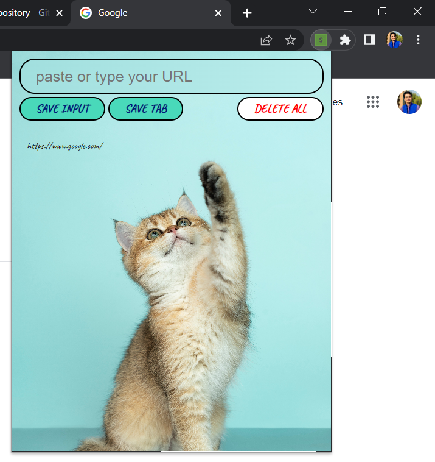

# Browser-Extension


## Requirement: 
- It should have a background image
- Input tab where a person can write their URL to save it
- buttons for saving input/typed url
- button for saving current opened tab
- button for deleting all bookmarks
- finally all saved bookmarks must be shown.


## Code
### HTML
``` 
<html>
    <head>
        <link rel="preconnect" href="https://fonts.googleapis.com">
        <link rel="preconnect" href="https://fonts.gstatic.com" crossorigin>
        <link href="https://fonts.googleapis.com/css2?family=Caveat:wght@500&display=swap" rel="stylesheet">
        <link rel="stylesheet" href="https://cdnjs.cloudflare.com/ajax/libs/normalize/8.0.1/normalize.css">
        <link rel="stylesheet" href="index.css">
    </head>
    <body>
        <input type="text" id="input-el" placeholder="paste or type your URL">
        <div class="flx">
            <div>
                <button id="input-btn">SAVE INPUT</button>
                <button id="tab-btn">SAVE TAB</button>
            </div>
       
            <div class="abc" >
                <button id="delete-btn">DELETE ALL</button>
            </div>
            
        </div>
        
        
        <ul id="ul-el">
        </ul>
        <script src="index.js"></script>
    </body>
</html>
 ```

### CSS
```
body {
    margin: 0;
    padding: 10px;
    font-family: Arial, Helvetica, sans-serif;
    min-width: 400px;
    background-image: url(cat.jpg);
    background-size: 100%;
    background-repeat: no-repeat;
   display: flex;
   flex-direction: column;    }
.flx{  display: flex; }
input {
    width: 100%;
    padding: 10px 20px;
    box-sizing: border-box;
    border: 2px solid black;
    margin-bottom: 4px;
    border-radius: 20px;
    font-family: sans-serif;
    font-size: 20px;;
    color: black;
    background: linear-gradient(to right,#A1DFDE, #BBEDEC);
}
button {
    font-family: 'Caveat', cursive;
    background: #49d9ba;
    color: rgb(1, 27, 121);
    padding: 5px 20px;
    border: 1px solid #5f9341;
    font-size: 15px;
    font-weight: bold;
    border: 2px solid black;
    border-radius: 20px; }
.abc{
    margin-left: auto;
}
#delete-btn {
    background: white;
    color: red;}
ul {
    margin-top: 20px;
    list-style: none;
    padding-left: 0;}

li { margin-top: 5px;}
a {
    font-family: 'Caveat', cursive;
    color: black;
    text-decoration: none;
    padding-left: 10px;
}


```

### JavaScript
```
let myLeads = []
const inputEl = document.getElementById("input-el")
const inputBtn = document.getElementById("input-btn")
const ulEl = document.getElementById("ul-el")
const deleteBtn = document.getElementById("delete-btn")
const leadsFromLocalStorage = JSON.parse( localStorage.getItem("myLeads") )
const tabBtn = document.getElementById("tab-btn")

if (leadsFromLocalStorage) {
    myLeads = leadsFromLocalStorage
    render(myLeads)
}

tabBtn.addEventListener("click", function(){    
    chrome.tabs.query({active: true, currentWindow: true}, function(tabs){
        myLeads.push(tabs[0].url)
        localStorage.setItem("myLeads", JSON.stringify(myLeads) )
        render(myLeads)
    })
})

function render(leads) {
    let listItems = ""
    for (let i = 0; i < leads.length; i++) {
        listItems += `
            <li>
                <a target='_blank' href='${leads[i]}'>
                    ${leads[i]}
                </a>
            </li>
        `
    }
    ulEl.innerHTML = listItems
}

deleteBtn.addEventListener("dblclick", function() {
    localStorage.clear()
    myLeads = []
    render(myLeads)
})

inputBtn.addEventListener("click", function() {
    myLeads.push(inputEl.value)
    inputEl.value = ""
    localStorage.setItem("myLeads", JSON.stringify(myLeads) )
    render(myLeads)
})

```
### Manifest JSON
```
{
    "manifest_version": 3,
    "version": "1.0",
    "name": "Leads tracker",
    "action": {
        "default_popup": "index.html",
        "default_icon": "icon.png"
    },
    "permissions": [
        "tabs"
    ]
}

```
## Preview after completion
 
 
## How to Add this Extension to Chrome
### Steps:
1) Download this repository
2) Open Chrome then setting and then click on extensions  or just copy paste this in search bar--> chrome://extensions/
3) Click on developer mode on
4) click on Load Unpack and choose folder that has been dowloaded.
5) Extension will be shown in extension panel.
